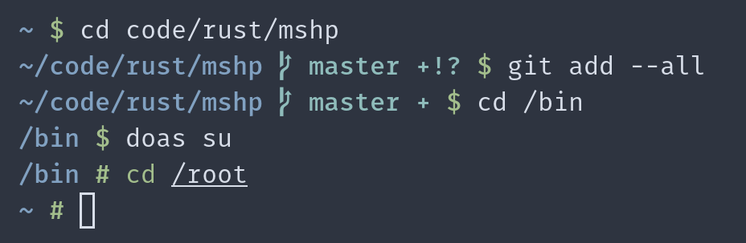

# mshp

[](https://github.com/yuqio/mshp/actions)
[](https://crates.io/crates/mshp)
[](https://github.com/yuqio/mshp#license)

**A minimal and fast shell prompt written in Rust.**



## Installation

### Building from source

1. Install and setup [Rust](https://www.rust-lang.org)
2. Run `cargo install mshp`

### Pre-compiled binary

1. Download a binary from the [releases page](https://github.com/yuqio/mshp/releases)
2. Move the binary to your `PATH`

## Usage

### Bash, Dash, Ksh, etc.

On most POSIX compatible shells you can add the following line to your init file (e.g. `.bashrc`):

```sh
PS1="$(mshp)"
```

### Zsh

Add the following to your `.zshrc` file:

```zsh
precmd() {
    PS1="$(mshp)"
}
```

### Ion

Add the following to your `.config/ion/initrc` file:

```ion
fn PROMPT
    echo -n "$(mshp)"
end
```

## Configuration

`mshp` can be configured via environment variables.

### Variable types

- **`Color`**: Takes one of the following as value:

    - `default` _(case insensitive)_ (sets the color to the default foreground color defined by the terminal)
    - A written out ANSII color (`black`, `red`, `green`, `yellow`, `blue`, `magenta`, `cyan`, `white`) _(case insensitive)_
    - A ANSII number (e.g. `1` for red)
    - A hex color beginning with `#` (e.g. `#00F` or `#0000FF` for blue)

- **`Boolean`**: Takes either `0`/`false` (deactivate setting) or `1`/`true` (activate setting) as value

- **`String`**: Takes any value

### Available environment variables

- **`MSHP_PATH_COLOR`**

    Sets the foreground color of the current working directory.

    Type: `Color`, Default: `blue`

- **`MSHP_GIT_BRANCH_ICON`**

    Sets the icon that is displayed next to the git branch.

    Type: `String`, Default: ``

- **`MSHP_GIT_BRANCH_COLOR`**

    Sets the foreground color used to display the git branch and the icon.

    Type: `Color`, Default: `cyan`

- **`MSHP_GIT_BRANCH_DISABLE`**

    Disables the git branch and icon.

    Type: `Boolean`, Default: `false`

- **`MSHP_GIT_STATUS_STAGED_ICON`**

    Sets the icon that is used to indicate uncommited and staged changes in the git repo.

    Type: `String`, Default: `+`

- **`MSHP_GIT_STATUS_UNSTAGED_ICON`**

    Sets the icon that is used to indicate uncommited and unstaged changes in the git repo.

    Type: `String`, Default: `!`

- **`MSHP_GIT_STATUS_UNTRACKED_ICON`**

    Sets the icon that is used to indicate untracked files in the git repo.

    Type: `String`, Default: `!`

- **`MSHP_GIT_STATUS_AHEAD_ICON`**

    Sets the icon that is used to indicate that your local branch is ahead of the upstream branch.

    Type: `String`, Default: `↥`

- **`MSHP_GIT_STATUS_BEHIND_ICON`**

    Sets the icon that is used to indicate that your local branch is behind the upstream branch.

    Type: `String`, Default: `↧`

- **`MSHP_GIT_STATUS_COLOR`**

    Sets the color for the above mentioned icons.

    Type: `Color`, Default: `cyan`

- **`MSHP_GIT_STATUS_DISABLE`**

    Disables the above mentioned icons.

    Type: `Boolean`, Default: `false`

- **`MSHP_CHAR_USER_ICON`**

    Sets the icon that is displayed at the end of the prompt to indicate that the current user is
    not the root user.

    Type: `String`, Default: `$`

- **`MSHP_CHAR_USER_COLOR`**

    Sets the color for the user character.

    Type: `Color`, Default: `green`

- **`MSHP_CHAR_USER_FAILED_ICON`**

    Sets the icon that is displayed at the end of the prompt to indicate that the current user is
    not the root user when the previous command failed.

    Type: `String`, Default: `$`

- **`MSHP_CHAR_USER_FAILED_COLOR`**

    Sets the color for the user character when the previous command failed.

    Type: `Color`, Default: `red`

- **`MSHP_CHAR_ROOT_ICON`**

    Sets the icon that is displayed at the end of the prompt to indicate that the current user is
    the root user.

    Type: `String`, Default: `#`

- **`MSHP_CHAR_ROOT_COLOR`**

    Sets the color for the root character.

    Type: `Color`, Default: `green`

- **`MSHP_CHAR_ROOT_FAILED_ICON`**

    Sets the icon that is displayed at the end of the prompt to indicate that the current user is
    the root user when the previous command failed.

    Type: `String`, Default: `#`

- **`MSHP_CHAR_ROOT_FAILED_COLOR`**

    Sets the color for the root character when the previous command failed.

    Type: `Color`, Default: `red`

## License

Licensed under either of [Apache License, Version 2.0] or [MIT License] at your
option.

[Apache License, Version 2.0]: https://github.com/yuqio/parg/blob/master/LICENSE-APACHE
[MIT License]: https://github.com/yuqio/parg/blob/master/LICENSE-MIT

Unless you explicitly state otherwise, any contribution intentionally submitted
for inclusion in this crate by you, as defined in the Apache-2.0 license, shall
be dual licensed as above, without any additional terms or conditions.
