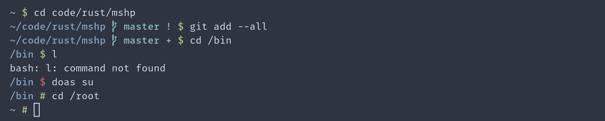

# mshp

[](https://github.com/yuqio/mshp/actions)
[](https://crates.io/crates/mshp)
[](https://github.com/yuqio/mshp/releases)
[](https://github.com/yuqio/mshp#license)



**A minimal and fast shell prompt written in Rust.**

- **Fast:** 🚀
- **Universal:** Works on any shell, on any operating system
- **Easy-to-hack:** Very easy to add a feature or change a behaviour due to the minimal codebase

## Installation

### Building from source

1. Install and setup [Rust](https://www.rust-lang.org)
2. Run `cargo install mshp`

### Pre-compiled binary

1. Download a binary from the [releases page](https://github.com/yuqio/mshp/releases)
2. Move the binary to your `PATH`

## Usage

### Bash, Dash, Ksh, etc.

On most POSIX compatible shells you can add the following line to your init file (e.g. `.bashrc`):

```sh
PS1="$(mshp)"
```

### Zsh

Add the following to your `.zshrc` file:

```zsh
precmd() {
    PS1="$(mshp)"
}
```

### Ion

Add the following to your `.config/ion/initrc` file:

```ion
fn PROMPT
    echo -n "$(mshp)"
end
```

## Configuration

`mshp` can be configured via environment variables.

### Color strings

Variables ending with `_COLOR` take a string as value that can be one of the following:

- `default` or empty (sets the color to the default foreground color defined by the terminal)
- A written out ANSII color (`black`, `red`, `green`, `yellow`, `blue`, `magenta`, `cyan`, `white`)
- A ANSII number (e.g. `1` for red)
- A hex color beginning with `#` (e.g. `#00F` or `#0000FF` for blue)

### Available settings

The following environment variables are available:

> Note: The values represent the default values that are used if the environment variable is not set

```sh
# Sets the foreground color used to display the current working directory.
MSHP_CWD_COLOR="blue"

# Sets the icon that is displayed next to the git branch name.
MSHP_GIT_BRANCH_ICON=""

# Sets the foreground color used to displaye the git branch name and the icon.
MSHP_GIT_BRANCH_COLOR="cyan"

# Disables the git branch name and icon.
# 
# The value `1` will activate this setting.
MSHP_GIT_BRANCH_DISABLE=0

# Sets the icon that is used to indicate uncommited and staged changes in the git repo.
MSHP_GIT_STAGED_ICON="+"

# Sets the icon that is used to indicate uncommited and unstaged changes in the git repo.
MSHP_GIT_UNSTAGED_ICON="!"

# Sets the icon that is used to indicate untracked files in the git repo.
MSHP_GIT_UNTRACKED_ICON="?"

# Sets the icon that is used to indicate that your local branch is ahead of  the upstream branch.
MSHP_GIT_AHEAD_ICON="↥"

# Sets the icon that is used to indicate that your local branch is behind the upstream branch.
MSHP_GIT_BEHIND_ICON="↧"

# Sets the colors for the above mentioned icons.
MSHP_GIT_STATUS_COLOR="cyan"

# Disables the above mentioned icons.
#
# The value `1` will activate this setting.
MSHP_GIT_STATUS_DISABLE=0

# Sets the icon that is displayed at the end of the prompt to indicate that the currnet user is not the root user.
MSHP_USER_INDICATOR="$"

# Sets the color for the user indicator icon.
MSHP_ROOT_INDICATOR_COLOR="green"

# Sets the icon that is displayed at the end of the prompt to indicate that the currnet user is the root user.
MSHP_ROOT_INDICATOR="#"

# Sets the color for the root indicator icon.
MSHP_ROOT_INDICATOR_COLOR="green"
```

## License

Licensed under either of [Apache License, Version 2.0] or [MIT License] at your
option.

[Apache License, Version 2.0]: https://github.com/yuqio/parg/blob/master/LICENSE-APACHE
[MIT License]: https://github.com/yuqio/parg/blob/master/LICENSE-MIT

Unless you explicitly state otherwise, any contribution intentionally submitted
for inclusion in this crate by you, as defined in the Apache-2.0 license, shall
be dual licensed as above, without any additional terms or conditions.
